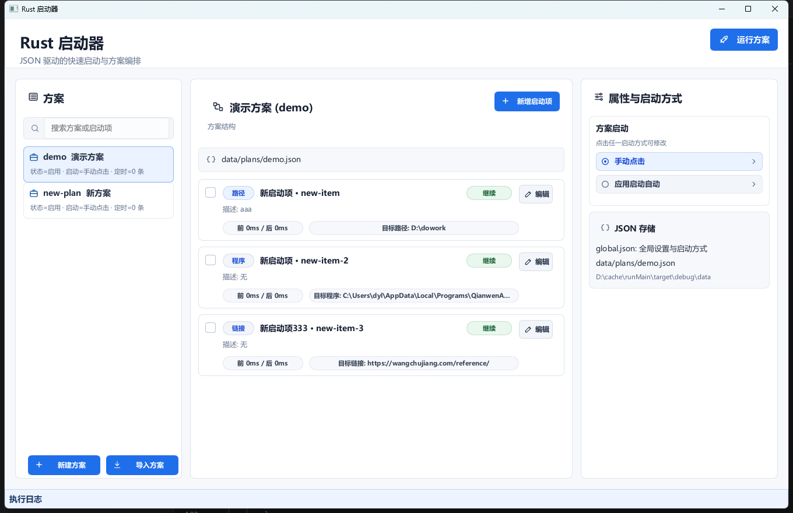
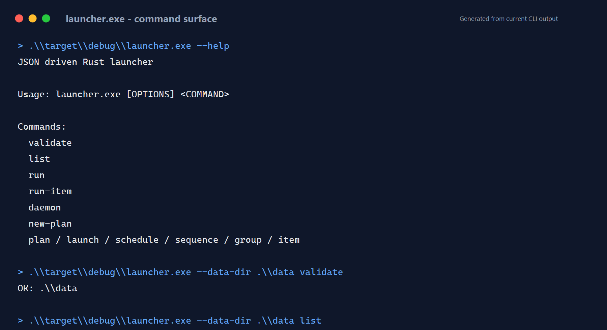
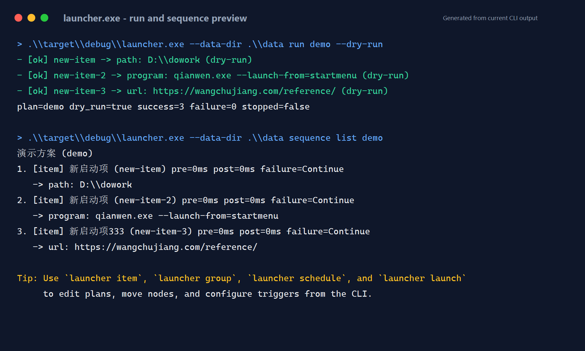

# Rust Launcher

> Windows-first native launcher for plans, groups, and launch items. JSON on disk, CLI for automation, Slint GUI for daily use.




## 中文版

Rust Launcher 是一个原生 Rust 快速启动器：你可以把文件夹、文档、程序、音乐、网页、命令组合成“方案”，再按顺序一键启动。它的组织结构很直接：

```text
方案 Plan
  组 Group
    单个启动项 Item
  单个启动项 Item
```

数据全部存为 JSON 文本。CLI 适合验证、批量编辑、脚本化和 dry-run；GUI 适合日常查看、编辑和真实运行方案。

### 当前能力

- Windows 优先：文件、文件夹、媒体、URL 使用系统默认方式打开。
- Windows 下尽量静默：`path/url` 直接走系统 Shell 打开，`command` 默认隐藏启动器产生的控制台窗口。
- JSON 持久化：`global.json` 管方案目录、启用状态、触发方式和定时；每个方案一个独立 JSON。
- 顺序编排：方案内按顺序执行，组内按顺序执行。
- 延迟控制：组和单个启动项均支持前置/后置延迟。
- 失败策略：每个启动项支持 `continue` 或 `stop`。
- CLI 完整管理：方案、启动方式、定时、组、单个启动项、排序、导入导出。
- GUI 工作台：方案列表、结构树、属性面板、启动方式、JSON 信息、执行日志。
- GUI 不提供 dry-run：点击“运行方案”会真实执行；dry-run 只在 CLI 中使用。

### 数据目录

默认数据目录在程序所在目录旁边创建和读取：

```text
launcher.exe
launcher-gui.exe
data/
  global.json
  plans/
    demo.json
```

开发时如果从 workspace 运行，常用目录是项目根目录下的 `data/`；如果直接运行 `target\debug\launcher-gui.exe`，则会使用 `target\debug\data\`。CLI 可以用全局参数覆盖：

```powershell
.\launcher.exe --data-dir .\data validate
```

### 快速开始

```powershell
cargo build --workspace

.\target\debug\launcher.exe --data-dir .\data validate
.\target\debug\launcher.exe --data-dir .\data list
.\target\debug\launcher.exe --data-dir .\data run demo --dry-run

.\target\debug\launcher-gui.exe
```

### GUI 用法


1. 启动 `launcher-gui.exe`。
2. 左侧选择方案；方案多时列表可滚动，也可以使用搜索框过滤。
3. 中间查看方案结构：组和单个启动项会按执行顺序展示。
4. 点击方案、组或单个启动项，右侧属性面板会同步显示详细信息。
5. 在右侧查看启动方式、定时数量和 JSON 存储路径。
6. 点击顶部“运行方案”真实执行当前方案。
7. 底部日志区会追加每个启动项的执行结果和错误信息。
8. 新建、重命名、删除、导入、组和启动项编辑等入口用于维护 JSON 配置；保存前会经过核心校验。

### CLI 截图





### CLI 完整用法

所有命令都支持全局参数 `--data-dir <DATA_DIR>`，位置在子命令前：

```powershell
.\launcher.exe --data-dir .\data <COMMAND>
```

基础命令：

```text
launcher validate
launcher list
launcher run <PLAN_ID> [--dry-run]
launcher run-item <PLAN_ID> <ITEM_ID> [--dry-run]
launcher daemon
launcher new-plan <ID> <NAME>
```

方案管理：

```text
launcher plan list
launcher plan new <ID> <NAME> [--file <FILE>]
launcher plan rename <ID> <NAME>
launcher plan delete <ID> [--delete-file]
launcher plan enable <ID>
launcher plan disable <ID>
launcher plan move <ID> <top|up|down|bottom>
launcher plan export <ID> <OUTPUT_PATH>
launcher plan import <SOURCE_PATH> [--overwrite]
```

启动方式：

```text
launcher launch show <PLAN_ID>
launcher launch set <PLAN_ID> <manual|auto>
```

定时：

```text
launcher schedule list <PLAN_ID>
launcher schedule add-daily <PLAN_ID> <TIME>
launcher schedule add-weekly <PLAN_ID> <monday|tuesday|wednesday|thursday|friday|saturday|sunday> <TIME>
launcher schedule add-once <PLAN_ID> <AT>
launcher schedule remove <PLAN_ID> <INDEX>
```

顺序：

```text
launcher sequence list <PLAN_ID>
launcher sequence move <PLAN_ID> <NODE_ID> <top|up|down|bottom>
```

组：

```text
launcher group add <PLAN_ID> <ID> <NAME> [--description <TEXT>] [--pre-delay-ms <MS>] [--post-delay-ms <MS>] [--on-failure <continue|stop>]
launcher group edit <PLAN_ID> <GROUP_ID> [--name <NAME>] [--description <TEXT>] [--pre-delay-ms <MS>] [--post-delay-ms <MS>] [--on-failure <continue|stop>]
launcher group delete <PLAN_ID> <GROUP_ID> [--keep-items]
```

新增启动项：

```text
launcher item add-path <PLAN_ID> <ID> <NAME> <VALUE> [--group <GROUP_ID>] [--description <TEXT>] [--pre-delay-ms <MS>] [--post-delay-ms <MS>] [--on-failure <continue|stop>]
launcher item add-program <PLAN_ID> <ID> <NAME> <VALUE> [--arg <ARG>]... [--working-dir <DIR>] [--group <GROUP_ID>] [--description <TEXT>] [--pre-delay-ms <MS>] [--post-delay-ms <MS>] [--on-failure <continue|stop>]
launcher item add-url <PLAN_ID> <ID> <NAME> <VALUE> [--group <GROUP_ID>] [--description <TEXT>] [--pre-delay-ms <MS>] [--post-delay-ms <MS>] [--on-failure <continue|stop>]
launcher item add-command <PLAN_ID> <ID> <NAME> <VALUE> [--shell <power-shell|cmd|sh>] [--working-dir <DIR>] [--group <GROUP_ID>] [--description <TEXT>] [--pre-delay-ms <MS>] [--post-delay-ms <MS>] [--on-failure <continue|stop>]
```

编辑启动项：

```text
launcher item edit <PLAN_ID> <ITEM_ID> [--name <NAME>] [--description <TEXT>] [--pre-delay-ms <MS>] [--post-delay-ms <MS>] [--on-failure <continue|stop>]
launcher item target-path <PLAN_ID> <ITEM_ID> <VALUE>
launcher item target-program <PLAN_ID> <ITEM_ID> <VALUE> [--arg <ARG>]... [--working-dir <DIR>]
launcher item target-url <PLAN_ID> <ITEM_ID> <VALUE>
launcher item target-command <PLAN_ID> <ITEM_ID> <VALUE> [--shell <power-shell|cmd|sh>] [--working-dir <DIR>]
launcher item move <PLAN_ID> <ITEM_ID> <top|up|down|bottom>
launcher item move-to-group <PLAN_ID> <ITEM_ID> <GROUP_ID>
launcher item move-to-root <PLAN_ID> <ITEM_ID>
launcher item delete <PLAN_ID> <ITEM_ID>
```

常用示例：

```powershell
.\launcher.exe --data-dir .\data plan new work "工作方案"
.\launcher.exe --data-dir .\data group add work dev "开发环境" --post-delay-ms 1000
.\launcher.exe --data-dir .\data item add-path work project "项目目录" "D:\cache\runMain" --group dev
.\launcher.exe --data-dir .\data item add-program work editor "编辑器" "C:\Users\me\AppData\Local\Programs\Microsoft VS Code\Code.exe" --arg "D:\cache\runMain"
.\launcher.exe --data-dir .\data item add-url work docs "参考文档" "https://www.rust-lang.org"
.\launcher.exe --data-dir .\data run work --dry-run
.\launcher.exe --data-dir .\data run work
```

### JSON 结构

`global.json` 记录方案目录和启动规则：

```json
{
  "version": 2,
  "globals": {
    "default_pre_delay_ms": 0,
    "default_post_delay_ms": 0,
    "log_retention_days": 14
  },
  "plans": [
    {
      "id": "demo",
      "file": "plans/demo.json",
      "enabled": true,
      "trigger": "manual",
      "schedule": []
    }
  ]
}
```

方案 JSON 记录结构和执行顺序：

```json
{
  "version": 2,
  "id": "demo",
  "name": "演示方案",
  "sequence": [
    {
      "kind": "group",
      "id": "dev",
      "name": "开发环境",
      "description": "打开工作目录和工具",
      "pre_delay_ms": 0,
      "post_delay_ms": 1000,
      "on_failure": "continue",
      "items": [
        {
          "id": "project-folder",
          "name": "项目目录",
          "description": "",
          "target": { "kind": "path", "value": "D:\\cache\\runMain" },
          "pre_delay_ms": 0,
          "post_delay_ms": 500,
          "on_failure": "continue"
        }
      ]
    }
  ]
}
```

### 开发验证

```powershell
cargo fmt --all -- --check
cargo test --workspace
cargo clippy --workspace --all-targets -- -D warnings
cargo build --workspace
```

### 项目结构

```text
crates/
  launcher-core/   JSON 模型、校验、调度、执行、平台启动适配
  launcher-cli/    命令行入口
  launcher-gui/    Slint GUI
data/              示例 JSON 数据
docs/assets/       README 截图资源
third_party/       GUI 中文文本渲染相关的本地补丁依赖
```

## English

Rust Launcher is a native Rust launcher for turning files, folders, programs, music, URLs, and shell commands into ordered launch plans. It stores everything as editable JSON and provides both a script-friendly CLI and a Slint desktop GUI.

### What It Does

- Opens paths, programs, URLs, and explicit shell commands.
- Minimizes Windows console flashes by opening paths/URLs through the system shell and running `command` items without an extra launcher console window by default.
- Stores global settings in `global.json` and each plan in its own JSON file.
- Runs plan sequences in order, including groups and standalone items.
- Supports pre/post delays on groups and items.
- Supports per-item failure policy: `continue` or `stop`.
- Provides a full CLI for validation, execution, editing, schedules, import, and export.
- Provides a GUI workbench for browsing, editing, running, and reading execution logs.
- Keeps dry-run in the CLI only; the GUI run button performs a real launch.

### Data Directory

By default, both binaries use a `data/` folder next to the running executable:

```text
launcher.exe
launcher-gui.exe
data/
  global.json
  plans/
    demo.json
```

Override it in the CLI with:

```powershell
.\launcher.exe --data-dir .\data validate
```

### Quick Start

```powershell
cargo build --workspace

.\target\debug\launcher.exe --data-dir .\data validate
.\target\debug\launcher.exe --data-dir .\data list
.\target\debug\launcher.exe --data-dir .\data run demo --dry-run

.\target\debug\launcher-gui.exe
```

### GUI Guide


1. Start `launcher-gui.exe`.
2. Select a plan from the left sidebar; the list scrolls when many plans exist.
3. Inspect the ordered plan tree in the center.
4. Select a plan, group, or item to update the right-side inspector.
5. Review launch trigger, schedules, and JSON storage details on the right.
6. Click the top run button to launch the selected plan.
7. Read item-level results in the bottom execution log.
8. Use the editing actions to maintain plan JSON; saves are validated by the core library.

### CLI Screenshots


### Complete CLI Reference

Global option:

```powershell
.\launcher.exe --data-dir .\data <COMMAND>
```

Core commands:

```text
launcher validate
launcher list
launcher run <PLAN_ID> [--dry-run]
launcher run-item <PLAN_ID> <ITEM_ID> [--dry-run]
launcher daemon
launcher new-plan <ID> <NAME>
```

Plan management:

```text
launcher plan list
launcher plan new <ID> <NAME> [--file <FILE>]
launcher plan rename <ID> <NAME>
launcher plan delete <ID> [--delete-file]
launcher plan enable <ID>
launcher plan disable <ID>
launcher plan move <ID> <top|up|down|bottom>
launcher plan export <ID> <OUTPUT_PATH>
launcher plan import <SOURCE_PATH> [--overwrite]
```

Launch modes:

```text
launcher launch show <PLAN_ID>
launcher launch set <PLAN_ID> <manual|auto>
```

Schedules:

```text
launcher schedule list <PLAN_ID>
launcher schedule add-daily <PLAN_ID> <TIME>
launcher schedule add-weekly <PLAN_ID> <monday|tuesday|wednesday|thursday|friday|saturday|sunday> <TIME>
launcher schedule add-once <PLAN_ID> <AT>
launcher schedule remove <PLAN_ID> <INDEX>
```

Sequence:

```text
launcher sequence list <PLAN_ID>
launcher sequence move <PLAN_ID> <NODE_ID> <top|up|down|bottom>
```

Groups:

```text
launcher group add <PLAN_ID> <ID> <NAME> [--description <TEXT>] [--pre-delay-ms <MS>] [--post-delay-ms <MS>] [--on-failure <continue|stop>]
launcher group edit <PLAN_ID> <GROUP_ID> [--name <NAME>] [--description <TEXT>] [--pre-delay-ms <MS>] [--post-delay-ms <MS>] [--on-failure <continue|stop>]
launcher group delete <PLAN_ID> <GROUP_ID> [--keep-items]
```

Items:

```text
launcher item add-path <PLAN_ID> <ID> <NAME> <VALUE> [--group <GROUP_ID>] [--description <TEXT>] [--pre-delay-ms <MS>] [--post-delay-ms <MS>] [--on-failure <continue|stop>]
launcher item add-program <PLAN_ID> <ID> <NAME> <VALUE> [--arg <ARG>]... [--working-dir <DIR>] [--group <GROUP_ID>] [--description <TEXT>] [--pre-delay-ms <MS>] [--post-delay-ms <MS>] [--on-failure <continue|stop>]
launcher item add-url <PLAN_ID> <ID> <NAME> <VALUE> [--group <GROUP_ID>] [--description <TEXT>] [--pre-delay-ms <MS>] [--post-delay-ms <MS>] [--on-failure <continue|stop>]
launcher item add-command <PLAN_ID> <ID> <NAME> <VALUE> [--shell <power-shell|cmd|sh>] [--working-dir <DIR>] [--group <GROUP_ID>] [--description <TEXT>] [--pre-delay-ms <MS>] [--post-delay-ms <MS>] [--on-failure <continue|stop>]
launcher item edit <PLAN_ID> <ITEM_ID> [--name <NAME>] [--description <TEXT>] [--pre-delay-ms <MS>] [--post-delay-ms <MS>] [--on-failure <continue|stop>]
launcher item target-path <PLAN_ID> <ITEM_ID> <VALUE>
launcher item target-program <PLAN_ID> <ITEM_ID> <VALUE> [--arg <ARG>]... [--working-dir <DIR>]
launcher item target-url <PLAN_ID> <ITEM_ID> <VALUE>
launcher item target-command <PLAN_ID> <ITEM_ID> <VALUE> [--shell <power-shell|cmd|sh>] [--working-dir <DIR>]
launcher item move <PLAN_ID> <ITEM_ID> <top|up|down|bottom>
launcher item move-to-group <PLAN_ID> <ITEM_ID> <GROUP_ID>
launcher item move-to-root <PLAN_ID> <ITEM_ID>
launcher item delete <PLAN_ID> <ITEM_ID>
```

### Development Checks

```powershell
cargo fmt --all -- --check
cargo test --workspace
cargo clippy --workspace --all-targets -- -D warnings
cargo build --workspace
```

### Repository Layout

```text
crates/
  launcher-core/   JSON models, validation, scheduler, execution, platform adapters
  launcher-cli/    Command-line interface
  launcher-gui/    Slint desktop UI
data/              Example JSON data
docs/assets/       README screenshots
third_party/       Local dependency patch for Chinese GUI text rendering
```
